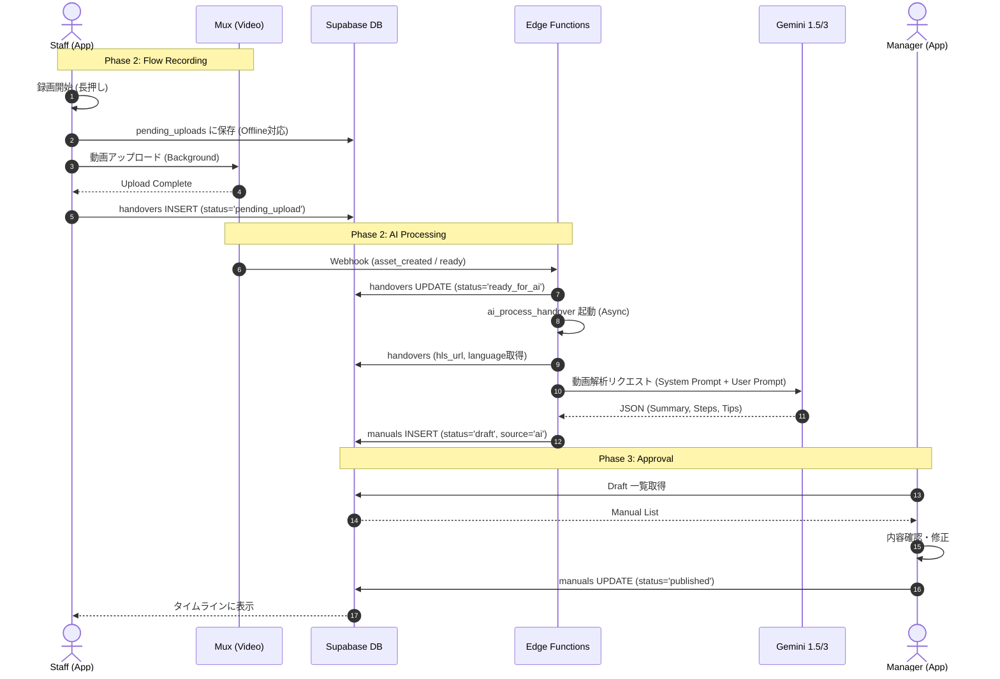
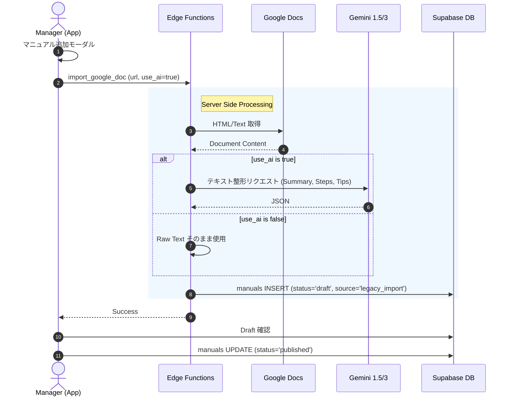
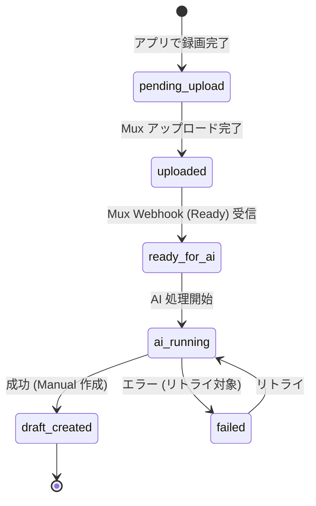
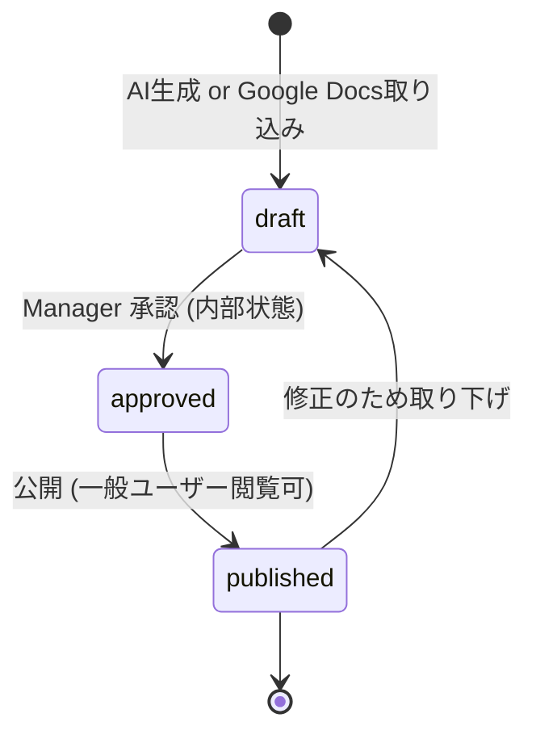
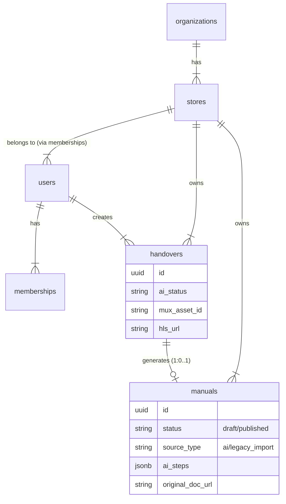

# BATON デザイン図面 v1.0

本ドキュメントは `docs/BATON_requirements_v8.6.md` および `docs/BATON_implementation_guide_v1.0.md` を補完する、開発者向けの視覚的資料です。

## 1. システムシーケンス図

### 1.1 Flow → Stock (動画からの自動生成)
現場スタッフが動画を撮影し、AI がマニュアル化するまでのメインフロー。



### 1.2 Google Docs Import (既存マニュアル取り込み)
Manager が既存の Google Docs を取り込むフロー。



---

## 2. UI 画面遷移図 (Screen Flow)

Flutter アプリの画面構成と遷移。

```mermaid
graph TD
    %% Nodes
    Splash[Splash Screen]
    Auth[Auth Screen]
    Home[Home / Timeline Screen]

    subgraph Flow [Flow Creation]
        Record[Recording Overlay]
        Upload[Upload Queue (Background)]
    end

    subgraph Viewer [Manual Viewer]
        Detail[Manual Detail Screen]
        VideoPlayer[Video Player]
    end

    subgraph Manager [Manager Zone]
        StockList[Stock List Screen]
        StockDetail[Stock Edit/Approve Screen]
        ImportModal[Google Docs Import Modal]
    end

    %% Edges
    Splash -->|Not Logged In| Auth
    Splash -->|Logged In| Home
    Auth --> Home

    Home -->|Long Press| Record
    Record -->|Finish| Home
    Record -.->|Save| Upload

    Home -->|Tap Card| Detail
    Detail -->|Play Video| VideoPlayer

    Home -->|Switch Tab (Manager Only)| StockList
    StockList -->|Tap Draft| StockDetail
    StockList -->|Add Button| ImportModal
    ImportModal -->|Submit| StockList
    StockDetail -->|Approve| Home
```

---

## 3. ステータス遷移図 (State Machine)

### 3.1 Handover (動画) ステータス
`handovers.ai_status` のライフサイクル。



### 3.2 Manual (マニュアル) ステータス
`manuals.status` のライフサイクル。



---

## 4. データモデル関連図 (ERD 簡易版)

主要テーブルの関係性。


