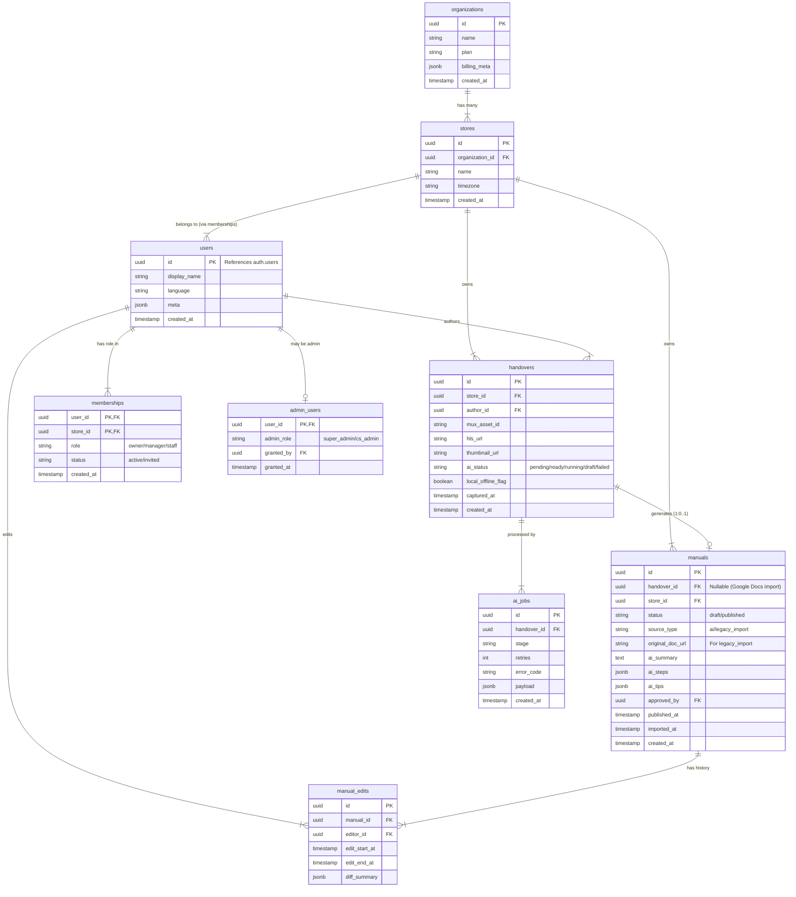

# TASUKI データベース設計書 v1.1

本ドキュメントは、TASUKI プロジェクト（v8.6 要件準拠）のデータベース構造、テーブル定義、およびセキュリティ設計（RLS）を詳細に記述したものです。

## 1. ER 図 (Entity Relationship Diagram)




---

## 2. テーブル定義詳細

### 2.1 組織・権限基盤

#### `organizations`
テナント（契約主体）を管理します。
- **id**: UUID (PK)
- **name**: テナント名
- **plan**: 契約プラン (例: `free`, `pro`)
- **billing_meta**: Stripe Customer ID 等

#### `stores`
実際の店舗単位。データ分離の境界（Tenant Isolation）となります。
- **id**: UUID (PK)
- **organization_id**: UUID (FK)
- **name**: 店舗名
- **timezone**: 店舗のタイムゾーン (例: `Asia/Tokyo`)

#### `users`
アプリケーションユーザー。Supabase Auth (`auth.users`) と 1:1 で紐付きます。
- **id**: UUID (PK, `auth.users.id` 参照)
- **display_name**: 表示名
- **language**: 使用言語 (例: `ja`, `en`, `vi`) - AI 出力言語の基準

#### `memberships`
ユーザーの店舗への所属とロールを管理します。
- **user_id**: UUID (PK, FK)
- **store_id**: UUID (PK, FK)
- **role**: 権限ロール (`owner`, `manager`, `staff`)
- **status**: 招待状態 (`active`, `invited`, `disabled`)

#### `admin_users`
システム管理者権限を持つユーザーを管理します（MVP では Optional、Post-PMF で実装推奨）。
- **user_id**: UUID (PK, FK - `auth.users.id`)
- **admin_role**: 管理者ロール
  - `super_admin`: 全機能アクセス、組織作成/停止、AI モデル切替
  - `cs_admin`: CS/運営向け、監査ログ閲覧、店舗復元
- **granted_by**: UUID (FK) - 権限を付与した管理者
- **granted_at**: TIMESTAMP - 権限付与日時

**MVP での代替実装**:
```sql
-- auth.users.raw_app_meta_data を使用
UPDATE auth.users
SET raw_app_meta_data = jsonb_set(
  COALESCE(raw_app_meta_data, '{}'::jsonb),
  '{is_admin}',
  'true'
)
WHERE email = 'admin@example.com';
```

**Root 権限**:
- **実装方法**: Supabase Service Role Key（`SERVICE_ROLE_KEY`）
- **用途**: スキーママイグレーション、RLS バイパス、緊急時の全データアクセス
- **アクセス**: 開発者のみ、Supabase CLI または Edge Functions 内で使用
- **RLS**: 自動的にバイパス


---

## 2.2 Flow & Stock (Core Data)

#### `handovers`
現場からアップロードされた動画（Flow）の実体。
- **id**: UUID (PK)
- **store_id**: UUID (FK) - RLS の基準
- **author_id**: UUID (FK) - 撮影者
- **mux_asset_id**: Mux の Asset ID
- **hls_url**: 動画再生 URL (Mux)
- **thumbnail_url**: サムネイル画像 URL
- **ai_status**: AI 処理ステータス
    - `pending_upload`: アップロード待ち
    - `uploaded`: アップロード完了
    - `ready_for_ai`: Webhook 受信済み
    - `ai_running`: Gemini 処理中
    - `draft_created`: マニュアル生成完了
    - `failed`: 処理失敗
- **local_offline_flag**: オフライン投稿かどうかのフラグ

#### `manuals`
マニュアル（Stock）の実体。AI 生成または Google Docs 取り込みにより作成されます。
- **id**: UUID (PK)
- **handover_id**: UUID (FK, Nullable) - 動画由来の場合に紐付け
- **store_id**: UUID (FK) - RLS の基準
- **status**: 公開ステータス
    - `draft`: 下書き（Manager のみ閲覧可）
    - `published`: 公開済み（Staff も閲覧可）
- **source_type**: 作成元
    - `ai`: 動画から AI 生成
    - `legacy_import`: Google Docs 等から取り込み
    - `manual`: 完全手動作成（将来用）
- **original_doc_url**: Google Docs の URL（`legacy_import` 時）
- **ai_summary**: 3行要約 (Text)
- **ai_steps**: 手順リスト (JSONB Array)
- **ai_tips**: コツ・ポイント (JSONB Array)
- **approved_by**: 承認者 (UUID)
- **published_at**: 公開日時

---

## 2.3 システム・ログ

#### `ai_jobs`
非同期 AI 処理のジョブキューおよび履歴。
- **id**: UUID (PK)
- **handover_id**: UUID (FK)
- **stage**: 処理ステージ
- **retries**: リトライ回数
- **error_code**: エラーコード

#### `manual_edits`
マニュアル編集の監査ログおよび品質評価用データ。
- **manual_id**: UUID (FK)
- **editor_id**: UUID (FK)
- **diff_summary**: 変更内容のサマリ（AI プロンプト改善用）

---

## 3. セキュリティ設計 (RLS & RBAC)

Supabase の Row Level Security (RLS) を使用し、データベース層で堅牢なアクセス制御を実現します。

### 3.1 基本ポリシー
1.  **Tenant Isolation**: 全てのクエリは `store_id` でフィルタリングされ、他店舗のデータは一切見えない。
2.  **Deny by Default**: 明示的に許可された操作以外は全て拒否。

### 3.2 ロール別権限マトリクス

| テーブル | Owner | Manager | Staff | 備考 |
| :--- | :---: | :---: | :---: | :--- |
| `organizations` | R | R | - | 自組織のみ |
| `stores` | R/W | R | R | 所属店舗のみ |
| `users` | R | R | R | 同一店舗のメンバーのみ |
| `handovers` | R/W | R/W | C/R | Staff は自分の投稿のみ編集可(要検討) |
| `manuals` | R/W | R/W | R | **Staff は `published` のみ閲覧可** |
| `manual_edits` | R | R | - | |

### 3.3 RLS ポリシー完全実装例

#### 3.3.1 manuals テーブル
```sql
-- SELECT: Staff は published のみ、Manager/Owner は全て閲覧可
CREATE POLICY "manuals_select_policy" ON "public"."manuals"
AS PERMISSIVE FOR SELECT
TO authenticated
USING (
  (store_id IN (
    SELECT store_id FROM memberships WHERE user_id = auth.uid() AND status = 'active'
  ))
  AND
  (
    -- Manager/Owner は全て閲覧可
    (EXISTS (
      SELECT 1 FROM memberships
      WHERE user_id = auth.uid()
        AND store_id = manuals.store_id
        AND role IN ('owner', 'manager')
        AND status = 'active'
    ))
    OR
    -- Staff は公開済みのみ閲覧可
    (status = 'published')
  )
);

-- INSERT: Manager/Owner のみ
CREATE POLICY "manuals_insert_policy" ON "public"."manuals"
AS PERMISSIVE FOR INSERT
TO authenticated
WITH CHECK (
  EXISTS (
    SELECT 1 FROM memberships
    WHERE user_id = auth.uid()
      AND store_id = manuals.store_id
      AND role IN ('owner', 'manager')
      AND status = 'active'
  )
);

-- UPDATE: Manager/Owner のみ
CREATE POLICY "manuals_update_policy" ON "public"."manuals"
AS PERMISSIVE FOR UPDATE
TO authenticated
USING (
  EXISTS (
    SELECT 1 FROM memberships
    WHERE user_id = auth.uid()
      AND store_id = manuals.store_id
      AND role IN ('owner', 'manager')
      AND status = 'active'
  )
)
WITH CHECK (
  EXISTS (
    SELECT 1 FROM memberships
    WHERE user_id = auth.uid()
      AND store_id = manuals.store_id
      AND role IN ('owner', 'manager')
      AND status = 'active'
  )
);
```

#### 3.3.2 handovers テーブル
```sql
-- SELECT: 同一店舗のメンバー全員
CREATE POLICY "handovers_select_policy" ON "public"."handovers"
AS PERMISSIVE FOR SELECT
TO authenticated
USING (
  store_id IN (
    SELECT store_id FROM memberships
    WHERE user_id = auth.uid() AND status = 'active'
  )
);

-- INSERT: 同一店舗のメンバー全員（Staffも投稿可）
CREATE POLICY "handovers_insert_policy" ON "public"."handovers"
AS PERMISSIVE FOR INSERT
TO authenticated
WITH CHECK (
  store_id IN (
    SELECT store_id FROM memberships
    WHERE user_id = auth.uid() AND status = 'active'
  )
  AND author_id = auth.uid()
);

-- UPDATE: 自分の投稿 または Manager/Owner
CREATE POLICY "handovers_update_policy" ON "public"."handovers"
AS PERMISSIVE FOR UPDATE
TO authenticated
USING (
  (author_id = auth.uid())
  OR
  (EXISTS (
    SELECT 1 FROM memberships
    WHERE user_id = auth.uid()
      AND store_id = handovers.store_id
      AND role IN ('owner', 'manager')
      AND status = 'active'
  ))
);
```

#### 3.3.3 memberships テーブル
```sql
-- SELECT: 同じ店舗のメンバーのみ閲覧可
CREATE POLICY "memberships_select_policy" ON "public"."memberships"
AS PERMISSIVE FOR SELECT
TO authenticated
USING (
  store_id IN (
    SELECT store_id FROM memberships
    WHERE user_id = auth.uid() AND status = 'active'
  )
);

-- INSERT: Owner/Manager のみ（スタッフ招待）
CREATE POLICY "memberships_insert_policy" ON "public"."memberships"
AS PERMISSIVE FOR INSERT
TO authenticated
WITH CHECK (
  EXISTS (
    SELECT 1 FROM memberships
    WHERE user_id = auth.uid()
      AND store_id = memberships.store_id
      AND role IN ('owner', 'manager')
      AND status = 'active'
  )
);

-- UPDATE: Owner のみ（ロール変更）
CREATE POLICY "memberships_update_policy" ON "public"."memberships"
AS PERMISSIVE FOR UPDATE
TO authenticated
USING (
  EXISTS (
    SELECT 1 FROM memberships m
    WHERE m.user_id = auth.uid()
      AND m.store_id = memberships.store_id
      AND m.role = 'owner'
      AND m.status = 'active'
  )
);
```

#### 3.3.4 stores テーブル
```sql
-- SELECT: 所属店舗のみ
CREATE POLICY "stores_select_policy" ON "public"."stores"
AS PERMISSIVE FOR SELECT
TO authenticated
USING (
  id IN (
    SELECT store_id FROM memberships
    WHERE user_id = auth.uid() AND status = 'active'
  )
);

-- UPDATE: Owner のみ
CREATE POLICY "stores_update_policy" ON "public"."stores"
AS PERMISSIVE FOR UPDATE
TO authenticated
USING (
  EXISTS (
    SELECT 1 FROM memberships
    WHERE user_id = auth.uid()
      AND store_id = stores.id
      AND role = 'owner'
      AND status = 'active'
  )
);
```

### 3.4 RLS 有効化とマイグレーションファイル例

```sql
-- supabase/migrations/20251201000000_init_schema.sql

-- RLS を有効化
ALTER TABLE public.manuals ENABLE ROW LEVEL SECURITY;
ALTER TABLE public.handovers ENABLE ROW LEVEL SECURITY;
ALTER TABLE public.memberships ENABLE ROW LEVEL SECURITY;
ALTER TABLE public.stores ENABLE ROW LEVEL SECURITY;

-- ポリシーを適用（上記の各ポリシーを記述）
-- ... (省略)

-- Service Role はバイパス（Edge Functions 用）
-- Edge Functions は SERVICE_ROLE_KEY を使用するため、RLS を自動的にバイパス
```

### 3.5 テスト用 SQL
```sql
-- Staff ユーザーで Draft マニュアルが見えないことを確認
SET request.jwt.claim.sub = 'staff_user_id';
SELECT * FROM manuals WHERE status = 'draft'; -- 0件

-- Manager ユーザーで Draft マニュアルが見えることを確認
SET request.jwt.claim.sub = 'manager_user_id';
SELECT * FROM manuals WHERE status = 'draft'; -- 見える
```

---

このRLS設計により、アプリケーション層のロジック無しでデータベース層で堅牢なアクセス制御が実現されます。
